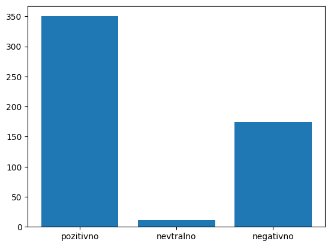
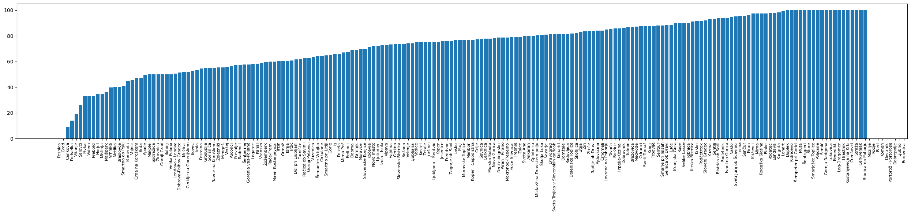
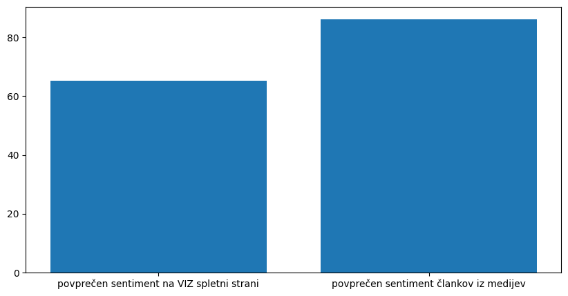

# Avtomatski zajem, obdelava in analiza podatkov o vzgojno izobraževalnih zavodih (VIZ)
## Pristop
### Zbiranje osnovnih podatkov o VIZ
Vsi osnovni podatki (občina, ravnatelj, spletna stran, ...) o vseh VIZ v sloveniji so na voljo v javni evidenci na [tej spletni starni](https://paka3.mss.edus.si/registriweb/Default.aspx).
### Izbor tehnologij in knjižnic
Za shranjevanje podatkov sem si izbral hitro in enostavno bazo podatkov SQLite. Programski jezik je Python. LLM za navigiranje spletnih strani je Googlov Gemini Flash Lite, do katerega program dostopa preko API-ja.
Za scraping je v glavnem uporabljen Selenium ter Urllib za upravljanje z URL-ji.
### Zajem podatkov s spletnih strani VIZ
Vsakaj spletna stran ima drugačno postavitev, komponente in obliko, zato je skoraj nemogoče zapisati univerzalnega scraping programa za vse spletne strani.
Pri tem izzivu so nam lahko v pomoč LLMi, ki analizirajo in razumejo posamezno spletno stran ter iz nje izluščijo želene podatke.
Scraping iz spletnih strani sem tako razdelil na 3 naloge:
* iskanje strani z novicami
* izluščanje povezav do posamičnih novic
* izluščanje vsebine novic

Pri vsaki nalogi sem uporabil Googlov LLM Gemini Flash Lite, ki je z 85% uspešnostjo opravil svojo nalogo. Hkrati je tudi najcenejši LLM API na trgu. Cena reševanje tega modula je približno 10€-15€.
### Zajem podatkov iz spletnih medijev
Zajem podatkov iz spletnih medijev ni predstavljal večjega izziva, saj sta dva medija zadoščala.
Pri takšni manjši količini spletnih strani je tudi zelo enostavno najti vzorce v spletnih straneh in zapisati scraping program za vsako posamično.
### Analiza sentimenta
Za analizo sentimenta je bil potreben Slovenski LM (language model). Najboljša izbira (tudi predlagana s strani Žejn Group) je sloberta.
Sam LM model za analizo sentimenta ni dovolj, saj potrebujemo model, ki lahko besedilo klasificira v pozitivno, nevtralno, negativno ali pa oceni pozitivnost na skali od 0 do 1.
Zato sem izbral sloberta-sentinews-sentence model, ki je "fine tuned" model za dodatnimi sloji za klasifikacijo treniran na čalnkih slovenskih medijev, kar mu daje v tem primeru še dodatno prednost.
Model je tudi relativno hiter - povprečno besedilo oz. članek iz baze zbrane v tem projektu je klasificiran v povprečno 0.3 sekunde.
## Rezultati
Končni rezultati nam pokažejo kar nekaj zanimivih ugotovitev.

*Več VIZ je ocenjenih kot pozitivni, nekoliko manj kot negativni, skoraj nič pa ni nevtralnih.*

*Občine, kot sta npr. Ljubljana in Koper od katerih bi pričakovali, da so na vrhu lestvice, so še kar povprečne.*

*Ta graf pa je od vseh najbolj nepričakovan. Obrazlaga je, da VIZ na svojih spletnih straneh objavljajo večimona le nevtralna obvestila, medtem, ko pa mediji pišejo o specifičnih VIZ tudi dobra mnenja in pozitivne članke.*

Na zadje je tukaj še [razpored vseh VIZ](./rezultati/rank.txt) od najbolje do najslebše ocenjenega.
## Drugo
Celotna implementacija in zasnova: [Rok Kužner](https://github.com/RokKuzner)

[Izziv in navodila](./izziv_in_navodila.pdf): Žejn Grup